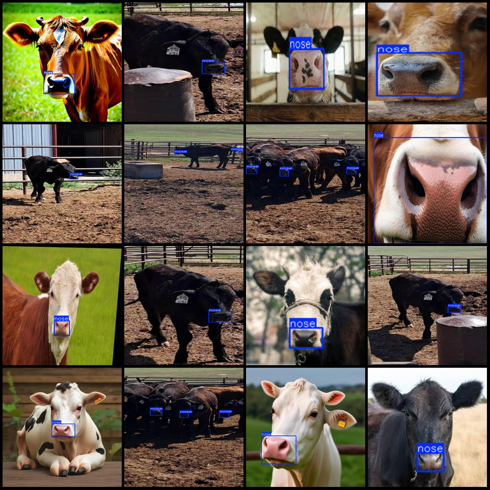
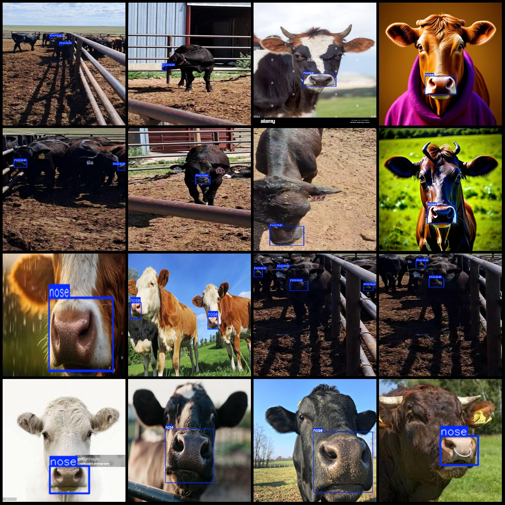

# Smart Dairy Cow Nose Pattern Detection Dataset - VOC+YOLO Format with 598 Images and One Category

The dataset format is Pascal VOC format plus YOLO format (without the split path in the txt file, only the jpg images along with corresponding VOC format xml files and YOLO format txt files).

Number of images (jpg file count): 598
Number of annotations (xml file count): 598
Number of annotations (txt file count): 598
Number of categories: 1
Annotation category name: ["nose"]
Number of bounding boxes per category:
nose = 710
Total bounding boxes: 710
Number of images per category:
nose = 598
Image resolution: Multi-resolution images, e.g., 1000x465, 1000x677, etc.
Annotation tool used: labelImg
Annotation rules: Draw a box around the category
Important note: The dataset does not have separate training, validation, and test sets to be divided.
Special declaration: This dataset does not guarantee the accuracy of the trained models or weight files.
Image preview:
Annotation example:

## Images

Here is a pay link on Stripe ( https://buy.stripe.com/3cs8yP7sY87d0vu9AB ). Please contact me lonlonago@foxmail.com after funding $89, and I will send you a complete data files , thank you!

